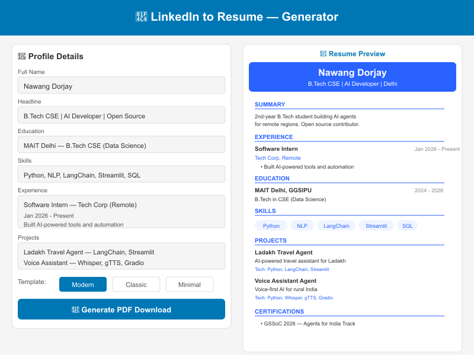

# 📄 LinkedIn to Resume Generator



Convert your LinkedIn profile into a professional resume PDF in seconds. Paste your data, pick a template, download.

Built by [Nawang Dorjay](https://github.com/nawangdorjay) — for **GSSoC 2026** (Agents for India Track).

---

## 🚀 Features

| Feature | Description |
|---------|-------------|
| 📋 **Easy Input** | Form-based input — paste data from your LinkedIn profile |
| 🎨 **3 Templates** | Modern (blue), Classic (serif), Minimal (clean) |
| 📥 **PDF Download** | Generate and download professional PDF resumes |
| 🔄 **JSON Import/Export** | Save your profile as JSON, reuse anytime |
| ✏️ **Fully Editable** | Adjust any field before generating |
| 🔒 **100% Private** | All processing happens locally in your browser |

---

## 📦 Installation

```bash
git clone https://github.com/nawangdorjay/linkedin-to-resume.git
cd linkedin-to-resume
pip install -r requirements.txt
streamlit run app.py
```

Open `http://localhost:8501`.

---

## 📁 Project Structure

```
linkedin-to-resume/
├── app.py                         # Streamlit UI (form + preview + download)
├── generator/
│   ├── __init__.py
│   ├── parser.py                  # Profile data model + LinkedIn text parser
│   └── resume_generator.py        # PDF and HTML generation (3 templates)
├── tests/
│   └── test_generator.py          # 11 validation tests
├── .github/workflows/
│   └── ci.yml                     # GitHub Actions CI
├── requirements.txt
├── .gitignore
└── README.md
```

---

## 🧪 Testing

```bash
python tests/test_generator.py
```

11 tests covering: profile creation, JSON serialization, HTML generation (all 3 templates), escaping, edge cases, and PDF generation.

---

## 🎨 Templates

| Template | Style | Best For |
|----------|-------|----------|
| **Modern** | Blue accent, clean sections | Tech, startups |
| **Classic** | Serif fonts, traditional | Corporate, traditional industries |
| **Minimal** | Light, lots of whitespace | Creative, design |

---

## 💡 How to Use

1. **Go to your LinkedIn profile** (linkedin.com/in/yourname)
2. **Copy the details** — name, headline, experience, education, skills
3. **Paste into the app** — fill in the form fields
4. **Pick a template** — Modern, Classic, or Minimal
5. **Preview** — see your resume in real-time
6. **Download PDF** — one click

---

## 🔮 Future Improvements

- [ ] Direct LinkedIn URL scraping (using browser automation)
- [ ] ATS-optimized template
- [ ] DOCX export (Word format)
- [ ] Photo upload support
- [ ] Custom color schemes
- [ ] Multi-page resume support

---

## 📄 License

MIT

---

## 👨‍💻 Author

**Nawang Dorjay** — B.Tech CSE (Data Science), MAIT Delhi
From Nubra Valley, Leh, Ladakh 🏔️

- [GitHub](https://github.com/nawangdorjay)
- [Email](mailto:nawangdorjay09@gmail.com)

Built for **GSSoC 2026** — Agents for India Track.
